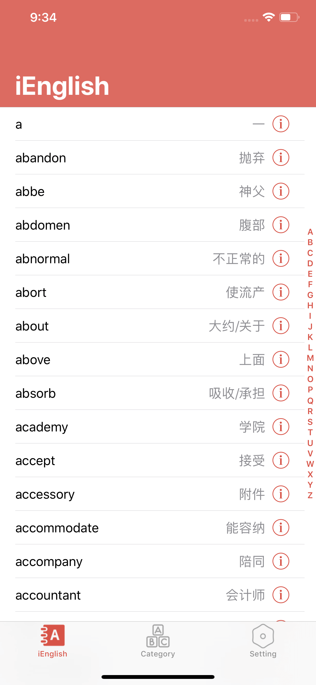
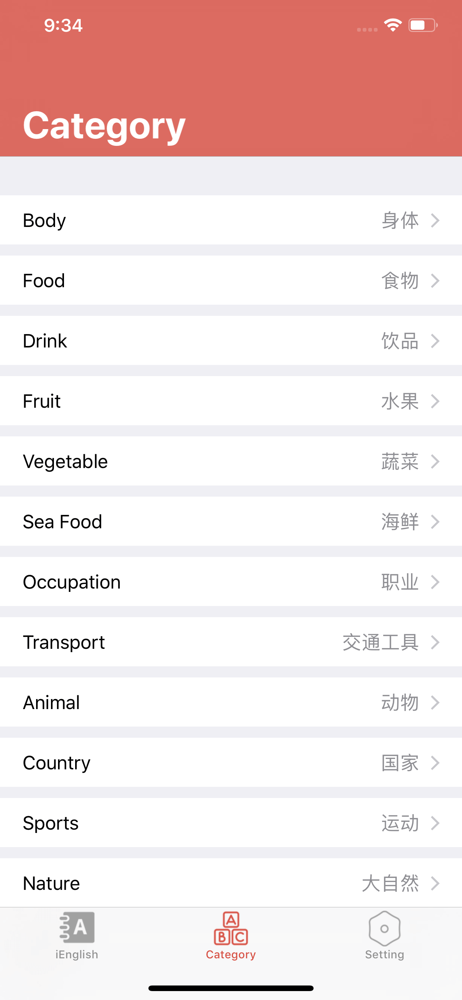
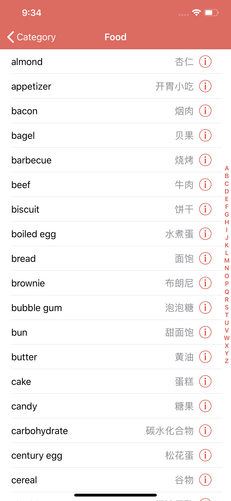
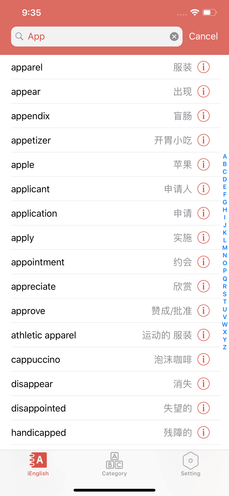
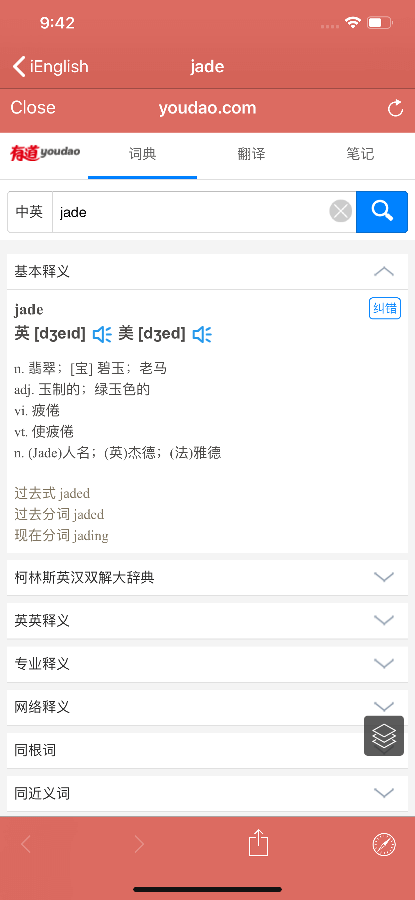

# iEnglish
iEnglish is English Beginner App for iOS , iPadOS, macOS

### Help and Support（帮助与支持）
- If you have any questions or suggestions, you can click [Help and Feedback](https://github.com/iHTCboy/iEnglish/issues)
- 如果你有任何疑问或建议，可以点击 [帮助与反馈](https://github.com/iHTCboy/iEnglish/issues)

### 项目介绍
iEnglish - 初学者必备词汇，3000入门单词和词汇分类学习

iEnglish - Beginner Essential Vocabulary, 3000 Entry Words and Vocabulary Classification Learning

iEnglish 是一款英语初学者提供基础英文单词学习的应用，正确的单词发音、必备的分类单词，不断努力打造更简单更好方式呈现更有趣的英语知识，让大家在零碎时间也可以快速和简单的学习get!

- 3000入门单词
- 全局单词搜索
- 准确的英文发音
- 常用单词分类汇总

这是英语初学者必备的单词学习的好工具，强烈推荐英文初学者的工具！希望它能成为你英语学习的快速阶梯！

#快捷键#
> 适配于 iPad 和 macOS

- **全局**

- command(⌘) + 1/2/3：切换 TabBar 标签栏
- command(⌘) + Escape：返回（如果是子页面，返回上一页面）

### 项目学习
- 本App可以学习到 Swift 开发 iOS App的技术。
- 本应用主要是学习到 Sqlite 数据库使用和最新的 Apple 技术，比如 MacCatalyst 。
- 希望更多人可以一起学习 iOS 开发或者有需要研究~

### 下载安装
1、AppStore付费支持
- [iOS App Store](https://itunes.apple.com/cn/app/ienglish-初学者必备词汇/id1236558125?l=zh&ls=1&mt=8)

2、编译安装
因为苹果开发者账号需要 ￥688 年费，所以 AppStore下载收费请见谅。你可以下载本项目代码在macOS系统编译安装。

### 应用更新日志

- v9.0.0
> 2023-01-27
> 可以自由创建背诵单词数，英文和中文同时播，支持后台播放，提高单词记忆的效率

- 适配 iOS 16 和 macOS Ventura
- 新增单词播放列表
- 新增中文词义朗读功能
- 新增重复朗读时间间隔设置

> 注：如果中文朗读无声音，请检查选择的声音是否有效。（设置 -> 辅助功能 -> 朗读内容 -> 声音 -> 中文）

- v8.8.0
> 2021-03-14

- 增加显示单词复数形式的开关；
- 增加显示单词中文解析的开关；
- 修复重置播放无法关闭的问题；
- 修复设置页面可能滚动不到底部的问题；
- 修复启动后导致正在播放音乐暂停的问题；

- v8.0.0
> 2020-12-20

新增声音设置：
- 支持音量增大
- 支持音速快慢
- 支持反复播放

最近更新：
- 全部单词现已支持音频
- 适配 iOS14 和 iPhone12

- v7.1.0
> 2020-04-19

- 1、增加键盘快捷键功能（适用于 iPad 和 macOS）
- 2、优化应用界面细节和用户体验

### 应用截图

|  |  |
| ----- | ----- |
|  |  |
|  |  |
